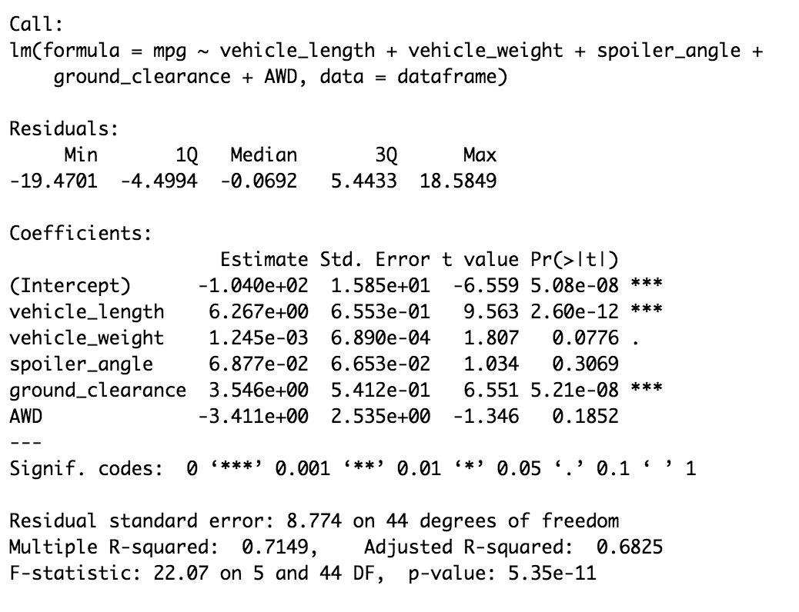
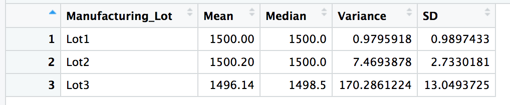
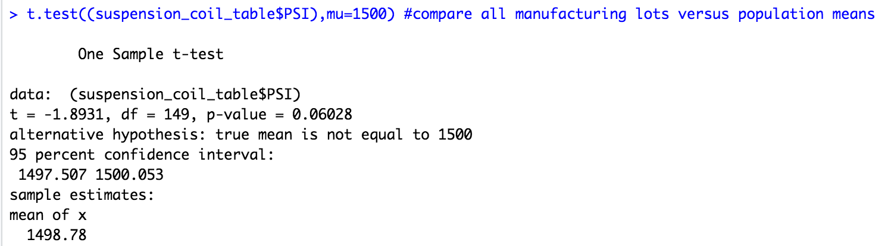
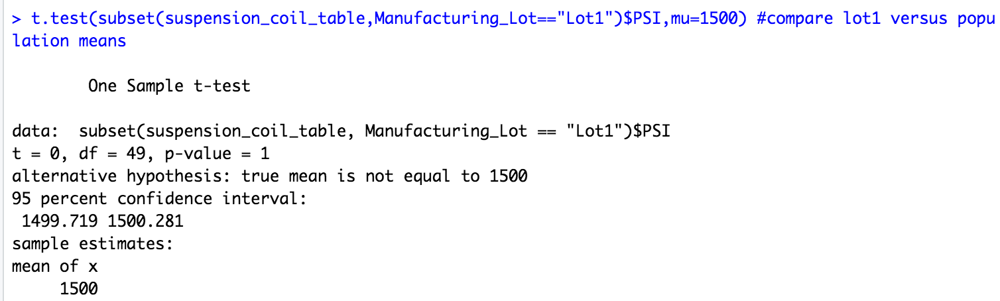
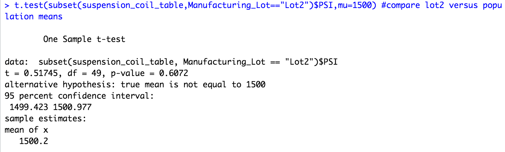
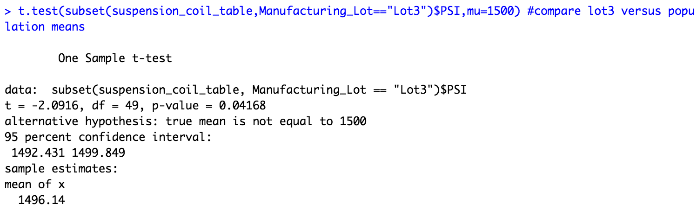

# MechaCar_Statistical_Analysis

## Linear Regression to Predict MPG

 
 Linear regression can be used as a predictive modeling tool, and also as an exploratory tool to quantify and measure the variability of two of more correlated variables.

 The above statistics of the multiple linear regression model illustrates that the slope, vehicle_length, and ground_clearance have highly significant p-values, while vehicle_weight has normal significant p-value. Those indicates that we can reject the null hypothesis which means there is a relationship between the vehicle_length and mpg; ground_clearce and mpg; and vehicle_wight and mpg. The slope of the linear model is not considered to be zero since it does have high significant p-value with three asterisks as well.

This linear model is overfitting, the model performs well with the current dataset, but fails to generalize and predict furture data correctly. 

## Summary Statistics on Suspension Coils

The above table shows four of the main aspects of the statistics for the suspension coil data we have. The mean, median, variance and standard deviation.

Based on the specifications for the MechaCar suspension coils, the variance of the suspension coils must not exceed 100 pounds per square inch. Currently, the overall summary for all three lots together does not exceed the required 100 pounds per square inch spec, which seems to meet the design specification. 

However, if we look at three lot individually, Lot1 and Lot2 are meeting the requirement, Lot3 is not. Lot3 has variance being 170, far beyond the 100 pounds per square inch specification. Therefore the design fails. 

## T-Tests on Suspension Coils

By using t.test() function, we can conclude based on the p-value (greater than the common significance level of 0.05%) that PSI across all manufacturing lots is statistically similar from the population mean of 1,500 pounds per square inch. Therefore it's not sufficient to reject the null hypothesis. Please see the screenshot below.

Also, by applying the t.test() on the individual lots with subset() argument, we can conclude that PSI for Manufacturing Lot 1 and Lot 2 are statistically similar from the population mean of 1,500 pounds per square inch, with only Lot 3 having statistical difference and reject the null hypothesis. See below screenshots.

## Study Design: MechaCar vs Competition

The study design looks at the following list of metrics:

- Car Price
- Customer Review
- Accident Occurance
- Fuel Efficiency
- Maintenance Cost
- Repair Frequency

For each of the above item, a null hypothesis is created, for example:
- Null Hypothesis: There is no difference between MechaCar models and Competition models on their fuel efficiency.
- Alternative hypothesis: There is significant differences on different models from both companies on fuel efficiency.

For the above mentioned hypothesis, ANOVA can be used to test the hypothesis, MechaCar and Competition company models (multiple) can be tested to see if there is any difference on their fuel efficiency.

In order to run the ANOVA test, a reasonable amount of vehicles for each model  needs to be selected with their model name collected, and their mileage and fuel consumption data.